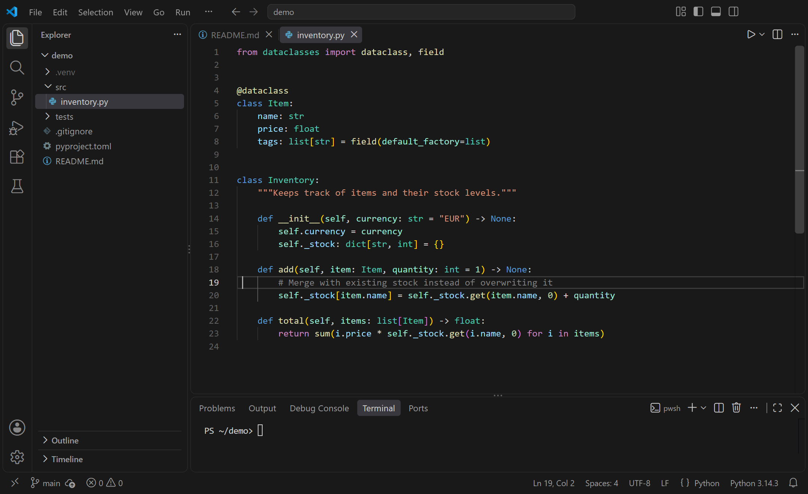

# Anjuna Theme

A darker take on VS Code's Dark Modern theme.



## Installation

Install **Anjuna Theme** from the Extensions view, or run:

```bash
code --install-extension gerecj.anjuna-theme
```

Then open the Command Palette (`Ctrl+Shift+P` / `Cmd+Shift+P`), run **Preferences: Color Theme** and select **Anjuna**.

## Pill editor tabs

The extension also sets the default of `workbench.experimental.modernUIEditorTabStyle` to `"pill"`, so editor tabs look like the panel tabs. This applies while the extension is installed, even with another color theme. To keep VS Code's connected tabs, add this to your settings:

```json
{
  "workbench.experimental.modernUIEditorTabStyle": "connected"
}
```

## Development

The theme is defined in [`themes/anjuna-color-theme.json`](themes/anjuna-color-theme.json). It includes [`dark_plus.json`](themes/dark_plus.json) and [`dark_vs.json`](themes/dark_vs.json), which are based on VS Code's built-in themes.

To try changes, open the repo in VS Code and press `F5`. Edits are picked up in the Extension Development Host window.

## License

[MIT](LICENSE). `themes/dark_plus.json` and `themes/dark_vs.json` are based on VS Code's default themes, also MIT licensed, © Microsoft Corporation. See [LICENSE](LICENSE) for both notices.
